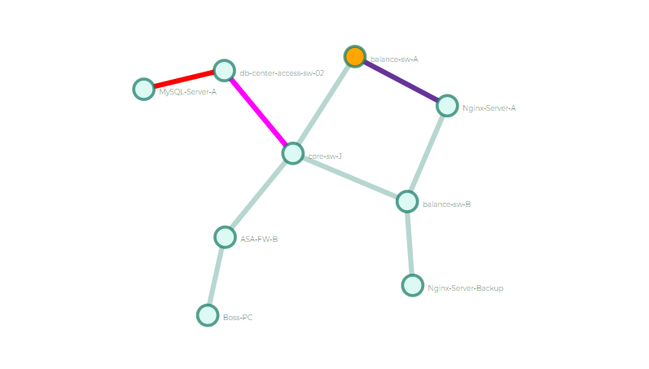
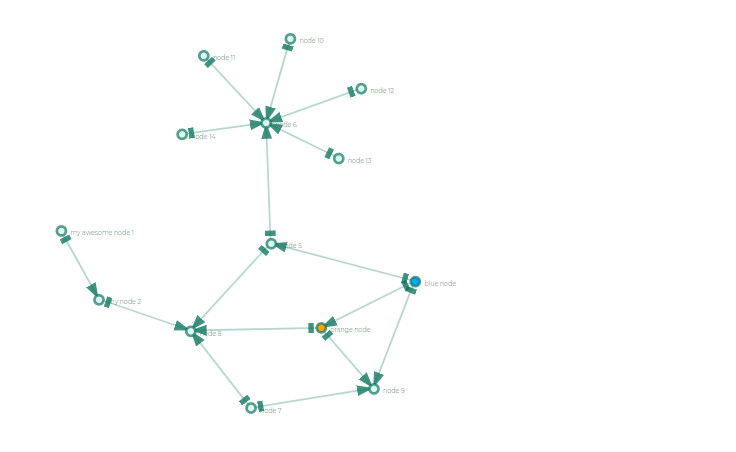
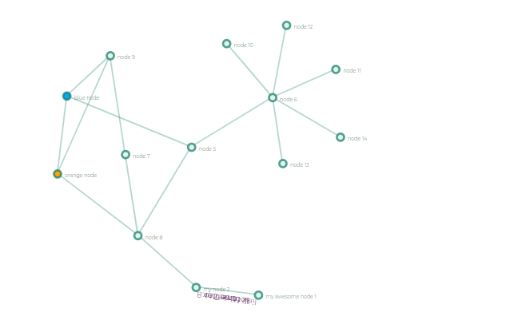

# doggy-net
Network topology and path


#### 环境安装
```
1. 安装nodejs(https://nodejs.org/en/)
2. 安装cnpm(npm install -g cnpm --registry=https://registry.npm.taobao.org)
```
#### 启动前端
```
cd frontend
cnpm install
npm run dev
```

然后在浏览器里输入：http:localhost:8080 即可访问

##### 1. base

##### 2. Path

##### 3. link label
